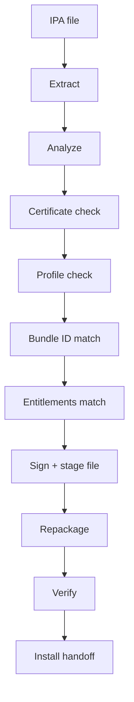

# VANTA Signing

## Pipeline



`SigningPipeline` (`Vanta/Signing/SigningPipeline.swift`) streams `Report`
values over `AsyncStream`, supports cooperative cancellation, and aborts after
120 seconds. Collaborators are injected (`InstallationVerifying`,
`PipelineLogging`) — the pipeline never touches a singleton:

```swift
public protocol SignerProvider: Sendable {
    var id: String { get }
    var displayName: String { get }
    func availability(certificate: SigningCertificate,
                      profile: ProvisioningProfile) -> SignerAvailability
    func sign(application: IPAPackage,
              certificate: SigningCertificate,
              profile: ProvisioningProfile,
              progress: @Sendable (Double) -> Void) async throws -> SignedPackage
}
```

Providers:

- `LocalCertificateSigner` — device Keychain identity; ready only when the
  Keychain holds the reference **and** the pair verifies.
- `ImportedCertificateSigner` — file-imported `.p12` identity.
- `PersonalTeamSigner` — free Apple ID flow, unavailable until configured.
- `RemoteSigner` — explicit opt-in integration, refuses without configuration.

`sign()` stages a **real file** (IPA copied to temp + manifest JSON + logged
SHA-256) and throws when there is no source file — it never returns a
placeholder path.

## What is *actually* verified

- Certificate: expiry, team consistency (`SigningChecks.verifyIdentity`)
- Provisioning profile: plist parse, `application-identifier`, team ID, expiry,
  entitlements subset check
- Bundle ID: exact or wildcard match against profile
- Entitlements: requested ⊆ granted, else `entitlementsMismatch` with diff
- Signature (post-sign): `codesign --verify`-equivalent check on macOS tooling;
  on iOS, verify metadata consistency and report limits honestly

## Error style (example)

> **Signing failed** (`VANTA_E413`)
> The selected provisioning profile does not match this Bundle Identifier.
> Bundle ID: `com.example.app` · Profile: `com.other.app`
> Actions: [Choose another profile]

See `Core/VantaError.swift` — every error has title, reason, remedy, and a
stable `VANTA_Exxx` code for log correlation.
