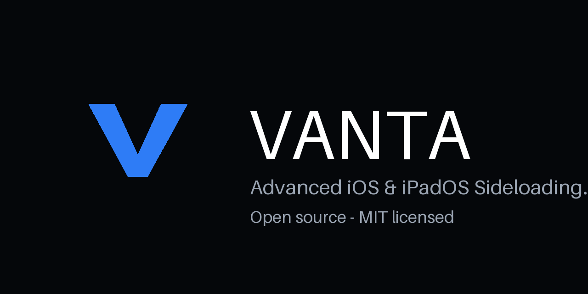
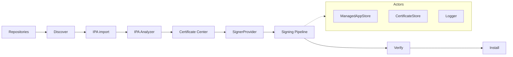

<div align="center">



# VANTA

**Advanced iOS & iPadOS Sideloading Manager.**

[](https://github.com/dbudakli1402-collab/VANTA/actions/workflows/build.yml)
[](https://github.com/dbudakli1402-collab/VANTA/actions/workflows/test.yml)
[](https://github.com/dbudakli1402-collab/VANTA/actions/workflows/release.yml)
[](https://github.com/dbudakli1402-collab/VANTA/actions/workflows/codeql.yml)
[](https://github.com/dbudakli1402-collab/VANTA/releases/latest)
[](https://developer.apple.com/ios/)
[](https://www.swift.org)
[](LICENSE)

</div>

VANTA is an independent, open-source sideloading manager for iOS & iPadOS —
comparable in *capability scope* to tools like Scarlet, KSign, or SideStore,
but with its **own UI, own architecture, and own branding**. No copied code,
no proprietary assets, no cloned logos.

> VANTA never fakes signing, validation, or installation. Unavailable steps show
> `Coming Soon` or `Not available in this environment` with a reason.

## Quick Start

**Latest release:** [GitHub Releases](https://github.com/dbudakli1402-collab/VANTA/releases)
([latest build](https://github.com/dbudakli1402-collab/VANTA/releases/latest)).

Every release attaches `VANTA.ipa` + `SHA256SUMS.txt` + `SBOM.json`, with the
signing status stated in the notes — **Signed** or **Unsigned**, never guessed.

- **Signed releases:** sideload with [Sideloadly](https://sideloadly.io),
  [AltStore](https://altstore.io), [SideStore](https://sidestore.io) or your
  preferred tool, then trust the profile under
  *Settings → General → VPN & Device Management*.
- **Unsigned releases:** re-sign with your own Apple certificate / provisioning
  profile first — unsigned IPAs cannot be installed as-is
  (see [`Documentation/RELEASING.md`](Documentation/RELEASING.md)).

## Verify checksum

```bash
shasum -a 256 -c SHA256SUMS.txt
```

Must print `VANTA.ipa: OK`. If it doesn't, do not install the file.

## Features

- 🏠 **Home dashboard** — device, iOS version, VANTA version, managed apps, active certificates, upcoming refreshes, activity feed
- 📦 **IPA Manager** — Files / Share Sheet / Drag & Drop (iPad) / URL import, queue + bulk install
- 🔍 **IPA Analyzer** — name, bundle ID, version, build, min iOS, architectures, entitlements, frameworks, signing info
- 🔑 **Certificate Center** — `.p12` / `.mobileprovision` import, inspect, test, remove
- ✍️ **Modular signer system** — `SignerProvider` protocol with real validation, pluggable providers
- 🔗 **Honest signing pipeline** — Extract → Analyze → Certificate → Profile → Bundle ID → Entitlements → Sign → Repackage → Verify → Install, per-step logs
- 🗂️ **Repository system** — validated JSON manifests, `https` by default, `http` warns
- 🧭 **Discover** — per-source app cards with always-visible source
- 🔄 **Refresh system** — honest expiry messaging, per-app + bulk refresh
- 💾 **Backup & Restore** — Keychain-backed, AES-GCM encrypted secrets
- 📁 **File Manager, Logs, Settings, About/GitHub integration**

## Architecture



Details: [`Documentation/ARCHITECTURE.md`](Documentation/ARCHITECTURE.md),
[`Documentation/SIGNING.md`](Documentation/SIGNING.md).

## Repository system

Repositories are JSON manifests, validated client-side before anything
is downloaded:

```json
{
  "name": "Example Repo",
  "identifier": "com.example.repo",
  "apps": [{
    "name": "Example",
    "bundleIdentifier": "com.example.app",
    "version": "1.2.3",
    "downloadURL": "https://example.com/app.ipa",
    "iconURL": "https://example.com/icon.png",
    "developer": "Example",
    "localizedDescription": "...",
    "versionDate": "2026-09-01T00:00:00Z"
  }]
}
```

`RepositoryValidator` enforces: `https` (or explicit `http` acknowledgement),
valid bundle IDs and versions, reachable IPA/icon URLs. See
`Vanta/Repositories/RepositoryValidator.swift`.

## Supported Devices

- iPhone, iOS 17.0+ (tab navigation)
- iPad, iPadOS 17.0+ (sidebar navigation, Split View, drag & drop)

## Development

Windows-first (see [`Documentation/BUILDING.md`](Documentation/BUILDING.md)):

```powershell
git clone https://github.com/dbudakli1402-collab/VANTA.git
cd VANTA
# edit on Windows, push → CI builds on the macOS runner
```

On macOS with Xcode 16+:

```bash
brew install xcodegen swiftlint swiftformat
xcodegen generate
swiftlint --strict
swiftformat --lint .
xcodebuild -scheme Vanta -destination 'platform=iOS Simulator,name=iPhone 16' build
xcodebuild test -scheme Vanta -destination 'platform=iOS Simulator,name=iPhone 16'
```

Releases are built from version tags (`git tag v1.1.0 && git push origin v1.1.0`);
see [`Documentation/RELEASING.md`](Documentation/RELEASING.md).

## GitHub Actions

| Workflow | Trigger | Does |
| -------- | ------- | ---- |
| `build.yml` | push / PR | XcodeGen → lint (strict) → format check → simulator build |
| `test.yml` | push / PR, nightly | unit + parser + security + UI tests |
| `release.yml` | version tag | tests → archive → IPA → validation → checksums → SBOM → Release assets |
| `codeql.yml` | push / PR, weekly | CodeQL static analysis (Swift) |
| `dependency-review.yml` | PR | dependency review |

Apple signing credentials come **only** from Actions Secrets
(`APPLE_CERTIFICATE`, `APPLE_CERTIFICATE_PASSWORD`,
`APPLE_PROVISIONING_PROFILE`, `APPLE_TEAM_ID`) — never committed.

## Security

See [`SECURITY.md`](SECURITY.md) and [`CONTRIBUTING.md`](CONTRIBUTING.md).
Keychain + AES-GCM, `.gitignore` blocks signing material, responsible
disclosure only. secret-scanning + push protection are enabled.

## FAQ

**Does VANTA work on Windows?**
You can develop, edit, and drive CI from Windows. Compiling + signing an iOS
`.ipa` requires macOS + Xcode (local Mac or GitHub macOS runner). No workaround
is faked — see `Documentation/BUILDING.md`.

**Is it a Scarlet / SideStore clone?**
No. Independent UI, architecture, and branding. Comparable *capability scope*
(IPA import, signing, repos, refresh), original implementation.

**Why does refresh say “unavailable”?**
Without a valid signing identity / network / Apple backend reachability, VANTA
tells you exactly why instead of inventing an expiry date.

**Can I install the unsigned IPA directly?**
No. Unsigned builds must be re-signed with your own Apple identity first.
The release notes always state the real signing status.

## Roadmap

- [x] v1.0.0 — honest unsigned release pipeline with validation
- [ ] Device screenshots (iPhone + iPad) from real builds
- [ ] Signed release via maintainer identity
- [ ] Localization (de, en)
- [ ] On-device `ldid`-style flow research (honest capability matrix)
- [ ] Refresh automation without fake promises
- [ ] Tweak injection metadata display
- [ ] tvOS / visionOS evaluation

## License

MIT — see [LICENSE](LICENSE).
